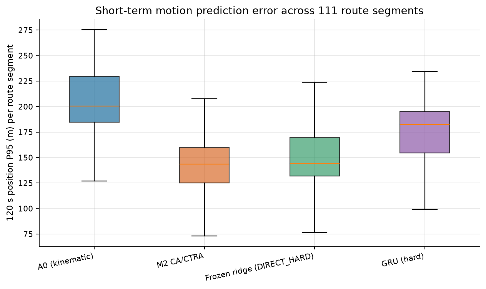
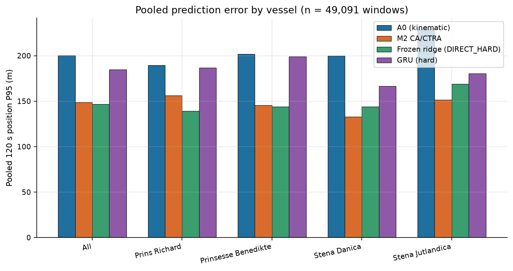

# OE 船舶短时运动预测（使用 AIS 数据）

基于 AIS 可观测信息开展客滚渡船短时运动预测与退化审计。

## 问题与方法

面向客滚渡船 30–120 秒地固运动预测，把 AIS 可观测信息、运动学先验、冻结岭回归与历史质量审计连接起来。当前实证来自丹麦 AIS；不同阶段使用不同船舶，不能把训练、选择与确认船舶混在一起描述。

本包确认结果来自 PRINS RICHARD、PRINSESSE BENEDIKTE、STENA DANICA、STENA JUTLANDICA 的 2025 年 3 月数据；此前阶段的 BERLIN、COPENHAGEN、COLOR FANTASY、COLOR MAGIC 是另一组研究数据。

`src/inference.py` 提供原冻结 DIRECT_HARD 模型的标准化、矩阵推理和反标准化公式；`model/frozen_ridge.npz` 为原冻结参数。`src/gru.py` 从既有补充实验提取 NumPy GRU 与反向传播。原始完整质量门与 AIS 特征生成链保存在原研究中，本包没有将一个简化包装器冒充该链。

## 运行与阅读

在仓库根目录运行 `python src/demo.py && python src/verify.py && python src/verify_gru_gradients.py`。演示生成训练均值附近的合成特征；不产生新的实测精度。程序还复算航段簇对照及 10,000 次 bootstrap，执行 GRU 数值梯度检查。

| 120 秒整体指标（已存结果） | A0 | M2 | DIRECT_HARD | 小型 GRU |
| --- | ---: | ---: | ---: | ---: |
| 位置 P95 / m | 200.23 | 148.71 | 146.55 | 184.94 |
| 位置中位误差 / m | 36.57 | 44.85 | 31.01 | 41.77 |
| 航向 MAE / ° | 4.45 | 17.45 | 4.37 | 4.85 |

但 111 个等权航段簇上 DIRECT_HARD−M2 的平均 P95 差为 **+6.0665 m**，95% 区间 **[2.6192, 9.4811] m**。这是统计口径不同产生的真实权衡，两个结论均须保留。

## 数据与限制

`data/cluster_metrics.csv` 是航段聚合统计，含日期、船名和路线标识，没有 AIS 经纬度轨迹。`confirmation_summary.json` 和 `fault_summary.json` 是历史结果，不把哈希验证视为独立重算。

无法由本包重建全部原始 AIS、注入历史故障或重新训练所有模型。严格回退到 A0 是可审计行为，不能视为最低误差或真实航行安全的证明；GRU 结果仅限小模型单种子配置。

来源入口：[丹麦海事局 AIS](https://www.dma.dk/safety-at-sea/navigational-information/ais-data)。完整原始包保留在本地，公开前另行确认再分发条件。

## Figures

Regenerate with `python figures/make_figures.py` (needs `matplotlib`, `pandas`, `numpy`).
